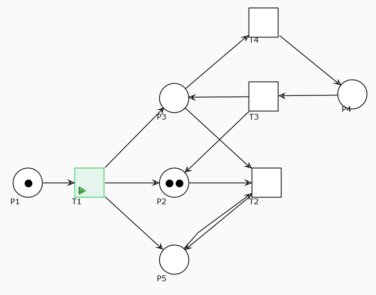

# 2 

## 2.3
Petri net is not bound given that there's a path through which we can generate unlimited tokens.

Since the petri net is not bound, it is also not safe.

The Petri Net is not conservative, since the number of tokens can grow unlimited.

The net is L3, but not L4 since there is a deadlock through T2

T2 is the deadlock, hence it is a dead transaction

The net is not a workflow net, since there is no place where the last output token is put which has no further edges. (i.e. "endstate")

# 3
